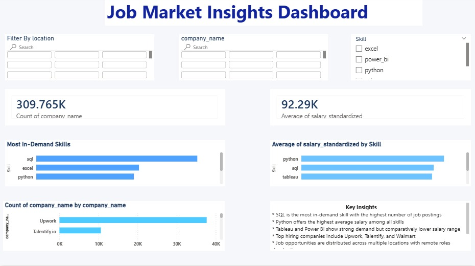
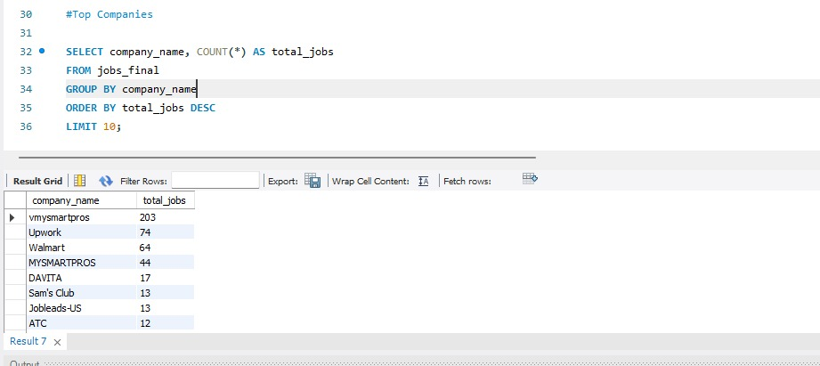
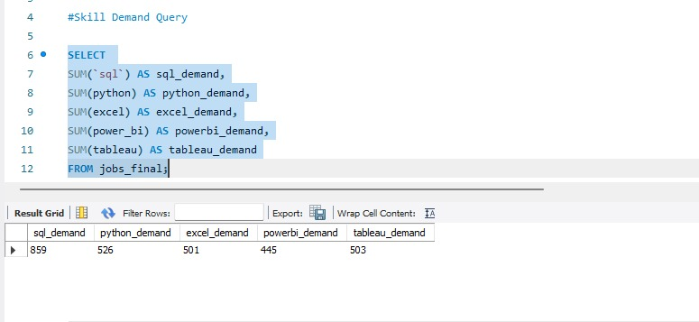
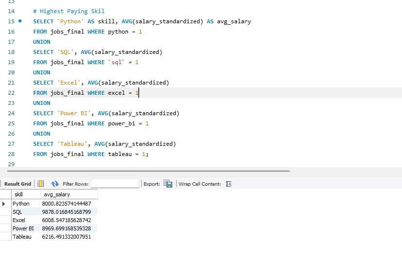

# 📊 Job Market Analysis Dashboard

## 🔍 Overview
This project analyzes 61,000+ job postings to understand:
- Skill demand  
- Salary trends  
- Hiring companies  

---

## 🛠 Tools Used
- Python (Pandas)  
- SQL  
- Power BI  

---

## 📈 Key Insights
- SQL is the most in-demand skill  
- Python offers highest average salary (~105K)  
- Excel is widely used but lower paying  
- Dataset contains only remote jobs  

---

## 📊 Dashboard Preview

---

## 🗄 SQL Queries
  
  

---

## 📁 Files
- Python analysis script  
- Cleaned dataset  
- SQL queries  
- Power BI dashboard  
